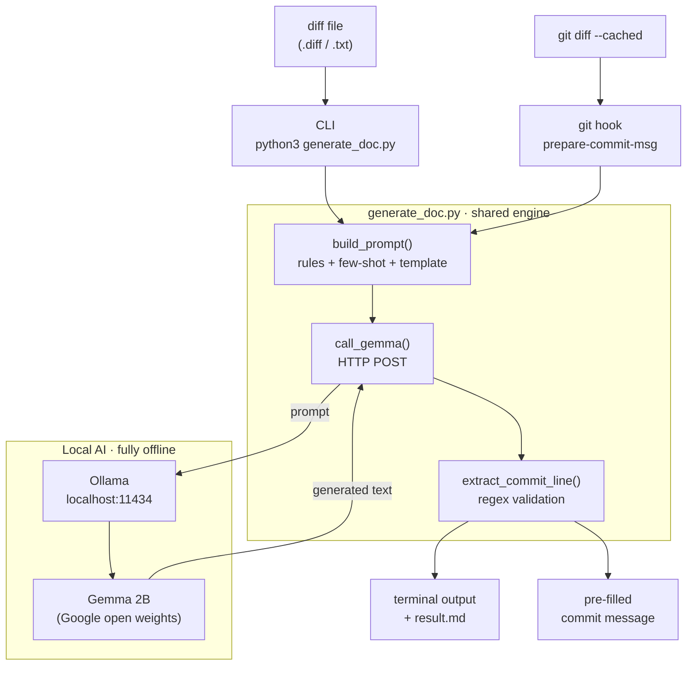

# Automagic Documenter (Git-to-Doc)

> Hackathon Track 1 — turn a raw `git diff` into a **Conventional Commit message** and a **Markdown changelog** using a local Google Gemma model. No frontend, pure CLI plumbing.

## What it does

Feed it a `.diff` (or `.txt`) file. It sends the diff to a local Gemma instance via Ollama and prints back:

```
## Commit Message
fix(parser): return null on empty input
## Changelog
- Fixed null pointer issue in the parser
```

The output is also saved to `result.md`.

## Architecture

Two entry points (the CLI and the git hook) share one engine, which talks to a
local Gemma model through Ollama — nothing leaves your machine.



| Stage | Responsibility |
|-------|----------------|
| **Entry points** | CLI for manual use, git hook for automatic suggestions |
| **`build_prompt`** | wraps the diff in rules + a few-shot example + a strict template |
| **`call_gemma`** | POSTs to Ollama and returns Gemma's response (handles errors/timeouts) |
| **`extract_commit_line`** | regex-validates the output is a real Conventional Commit |
| **Outputs** | prints markdown + saves `result.md`, or fills the commit message |

## Requirements

- Python 3
- [`requests`](https://pypi.org/project/requests/) — `pip install requests`
- [Ollama](https://ollama.com) running locally with the `gemma2:2b` model:

  ```bash
  ollama pull gemma2:2b
  ollama serve            # make sure the server is up on localhost:11434
  ```

## Usage

```bash
# basic
python3 generate_doc.py sample.diff

# custom output file
python3 generate_doc.py test_real.diff -o changelog.md

# help
python3 generate_doc.py --help
```

| Argument | Required | Description |
|----------|----------|-------------|
| `input_file` | yes | path to the `.diff` / `.txt` file to analyze |
| `-o`, `--output` | no | output filename (default: `result.md`) |

## Generating a diff to feed it

A `diff` is git's report of *what changed* between two states. The most common ways to produce one:

```bash
# uncommitted changes (most common)
git diff > my_change.diff

# staged changes (after `git add`)
git diff --staged > my_change.diff

# everything since the last commit (staged + unstaged) — safest
git diff HEAD > my_change.diff

# what a specific commit changed
git show <commit-id> > my_change.diff

# difference between two branches (i.e. a pull request)
git diff main..feature-branch > my_change.diff

# a single file only
git diff calculator.py > my_change.diff
```

You can also grab any GitHub pull request as a diff by appending `.diff` to its URL:

```bash
curl -L https://github.com/pallets/flask/pull/5000.diff > flask_pr.diff
```

### Real-world workflow

```bash
git diff HEAD > change.diff           # 1. capture your changes
python3 generate_doc.py change.diff   # 2. get a commit message + changelog

# or in one line, no temp file (process substitution):
python3 generate_doc.py <(git diff HEAD)
```

Then copy the suggested commit line into `git commit -m "..."`.

## Git hook — auto-suggest on every commit (zero typing)

Install the included `prepare-commit-msg` hook and you never have to run the
script by hand. Just `git commit`, and Gemma pre-fills the message in your editor.

```bash
# install into the current repo (or pass a path: ./install_hook.sh /path/to/repo)
./install_hook.sh
```

Then in that repo:

```bash
git add .
git commit            # no -m: your editor opens with an AI-suggested message already filled in
```

Example of what lands in the editor:

```
refactor(auth): implement password check in user login

# ^ AI-suggested commit message (Gemma). Edit or delete as you like.
```

Design notes:

- **Never blocks a commit.** If Ollama is down or anything fails, the hook exits cleanly and leaves your message untouched — committing always works.
- **Only fires when needed.** It skips `git commit -m`, merges, squashes, and amends, so it only helps when you'd otherwise be writing a message from scratch.
- **Reuses the same engine.** The hook imports `build_prompt` / `call_gemma` / `extract_commit_line` from `generate_doc.py` — no duplicated prompt logic.

## How it works

```
diff file → read → build prompt (rules + example + template) → Gemma (Ollama) → validate → print + save
```

1. **Strict prompt** — restricts the commit `type` to `feat/fix/docs/refactor/test/chore`, gives a few-shot example, and forbids conversational filler.
2. **Conventional Commit validation** — a regex checks the model output really matches `type(scope): description` and warns if it doesn't.
3. **Edge-case hardening** — handles a missing file, an empty file, Ollama being offline, and request timeouts with friendly messages instead of crashing.

## Files

| File | Purpose |
|------|---------|
| `generate_doc.py` | the main CLI script (also exposes reusable functions) |
| `hooks/prepare-commit-msg` | git hook template that auto-fills commit messages |
| `install_hook.sh` | one-command installer for the git hook |
| `sample.diff` | minimal demo diff (Hello World → Hackathon) |
| `test_real.diff` | a more realistic multi-file PR diff for testing generalization |
| `result.md` | latest generated output |
